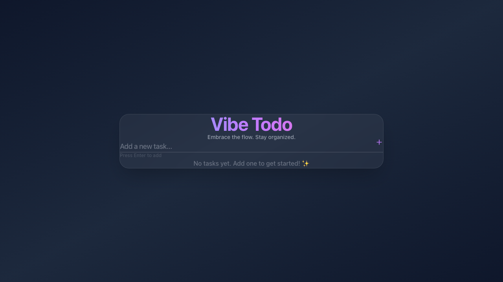

# 🎨 Vibe Todo - 스타일리시한 할 일 관리 앱

> **Premium S-Rank Quality** 완벽한 한글 로컬라이제이션과 최신 기술 스택으로 구현된 현대적인 할 일 관리 애플리케이션



## ✨ 주요 기능

### 📋 기본 기능
- ✅ 할 일 추가/수정/삭제 (실시간 저장)
- 🎯 우선순위 설정 (높음/중간/낮음)
- 📁 카테고리 분류 (업무/개인/학습)
- 📅 마감일 설정 (오늘/내일/1주일/커스텀)
- 🔍 검색 및 필터링
- 📊 통계 대시보드 (진행률, 완료 현황, 기한 초과 등)

### 🔄 고급 기능 (Phase 6)
- 🔁 **반복 작업** - 매일/매주/매월 반복 설정
- 🔔 **브라우저 알림** - 다가오는 마감일 및 기한 초과 알림
- 💾 **데이터 내보내기** - CSV 및 JSON 형식 지원
- 📥 **데이터 가져오기** - 이전 내보낸 JSON 파일 복원

### 🎨 UI/UX
- 🌈 Glassmorphism 디자인
- ✨ Framer Motion 애니메이션
- 📱 반응형 레이아웃
- 🌙 다크 테마 (확장 가능)
- 🇰🇷 완벽한 한글 로컬라이제이션

## 🛠️ 기술 스택

```json
{
  "frontend": "React 18 + Vite",
  "styling": "Tailwind CSS v4 + Glassmorphism",
  "animation": "Framer Motion",
  "icons": "Lucide React",
  "storage": "LocalStorage API",
  "notifications": "Browser Notification API",
  "ai": "Perplexity API (작업 구체화)"
}
```

## 📦 설치 및 실행

### 필수 요구사항
- Node.js 18+
- npm 또는 yarn

### 설치
```bash
# 저장소 클론
git clone https://github.com/slowtokki0409/vibe-todo.git
cd vibe-todo

# 의존성 설치
npm install

# .env 파일 생성 (선택사항 - AI 기능 사용시)
echo "VITE_PERPLEXITY_API_KEY=your_api_key_here" > .env
```

### 개발 서버 실행
```bash
npm run dev
# http://localhost:5175 에서 접속
```

### 빌드
```bash
npm run build
npm run preview
```

## 📁 프로젝트 구조

```
vibe-todo/
├── src/
│   ├── components/
│   │   ├── Layout.jsx              # 메인 레이아웃
│   │   ├── TodoInput.jsx           # 입력 폼
│   │   ├── TodoList.jsx            # 목록 표시
│   │   ├── TodoFilter.jsx          # 필터 & 검색
│   │   ├── TodoStats.jsx           # 통계 대시보드
│   │   ├── TodoEditModal.jsx       # 편집 모달
│   │   ├── TodoRecurring.jsx       # 반복 & 알림
│   │   └── ActionBar.jsx           # 내보내기/가져오기
│   ├── services/
│   │   └── perplexity.js           # AI 통합
│   ├── utils/
│   │   ├── export.js               # CSV/JSON 내보내기
│   │   └── notifications.js        # 브라우저 알림
│   ├── App.jsx                     # 앱 메인 컴포넌트
│   ├── index.css                   # 전역 스타일
│   └── main.jsx                    # 진입점
├── index.html
├── tailwind.config.js
├── vite.config.js
└── package.json
```

## 🎯 개발 로드맵

### ✅ 완료된 기능
- [x] Phase 1: 기초 설정 (React + Vite + Tailwind)
- [x] Phase 2: 기본 UI 컴포넌트
- [x] Phase 3: 할 일 CRUD 기능
- [x] Phase 4: 핵심 기능 (우선순위, 카테고리, 마감일)
- [x] Phase 5: 사용성 개선 (편집 모달, 통계, 다중 선택)
- [x] Phase 6: 고급 기능 (반복, 알림, 내보내기)
- [x] 한글 로컬라이제이션 (S-Rank 품질)

### 🚀 향후 개선 계획
- [ ] 다크/라이트 테마 토글
- [ ] 사용자 계정 및 클라우드 동기화
- [ ] 태그 시스템
- [ ] 칸반 보드 뷰
- [ ] 협업 기능
- [ ] 모바일 앱 (React Native)
- [ ] 데스크톱 앱 (Electron)

## 💡 사용 예시

### 할 일 추가
1. 텍스트 입력 필드에 할 일 입력
2. "고급 옵션" 클릭하여 우선순위, 카테고리, 마감일 설정
3. "추가" 버튼 또는 Enter 키로 추가

### 반복 작업 설정
1. 할 일 클릭하여 수정 모달 오픈
2. "반복 설정" 버튼으로 반복 주기 선택
3. "알림 설정" 버튼으로 알림 활성화
4. "저장" 클릭

### 데이터 내보내기
1. "CSV" 또는 "JSON" 버튼 클릭
2. 자동으로 다운로드 시작
3. CSV는 Excel, JSON은 백업/복원용

## 🔐 개인정보 보호

- 모든 데이터는 **로컬 스토리지**에 저장됨
- 서버로 데이터 전송 없음
- Perplexity API는 선택사항 (AI 기능 사용시에만)

## 🤝 기여 방법

1. Fork the repository
2. Create your feature branch (`git checkout -b feature/AmazingFeature`)
3. Commit your changes (`git commit -m 'Add some AmazingFeature'`)
4. Push to the branch (`git push origin feature/AmazingFeature`)
5. Open a Pull Request

## 📝 라이선스

MIT License - 자유롭게 사용, 수정, 배포 가능합니다.

## 📧 연락처

- GitHub: [@slowtokki0409](https://github.com/slowtokki0409)
- 이슈 및 제안: [GitHub Issues](https://github.com/slowtokki0409/vibe-todo/issues)

---

**Made with ❤️ using Claude Code + AntiGravity**

**Status**: 🎯 S-Rank Premium Quality | 개발 중 (Development in Progress)
